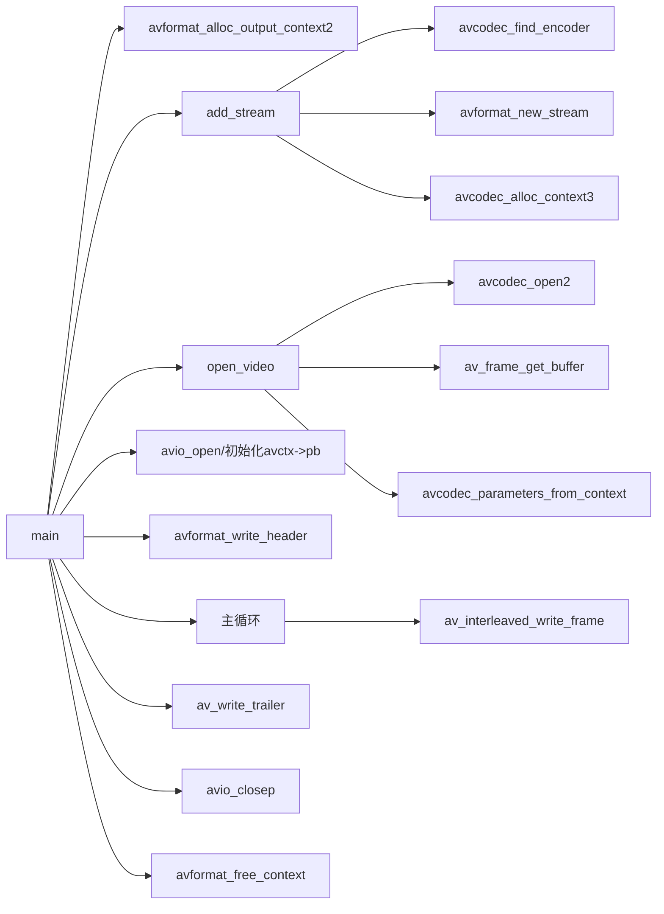

# 日志

使用开源库[EasyLogger](https://github.com/armink/EasyLogger)

## 使用方法记录

### 导入项目

1. 下载源码；
2. 将`\easylogger\`（里面包含`inc`、`src`及`port`的那个）文件夹拷贝到项目中；
3. 添加`\easylogger\src\elog.c`、`\easylogger\src\elog_utils.c`及`\easylogger\port\elog_port.c`这些文件到项目的编译路径中（elog_async.c 及 elog_buf.c 视情况选择性添加）；
4. 添加`\easylogger\inc\`文件夹到编译的头文件目录列表中。

由于需要使用写文件功能，实际引入文如下

```
header files:
	- elog.h
	- elog_cfg.h
	- elog_file.h
	- elog_file_cfg.h
	
source files:
	- elog.c
	- elog_utils.c
	- elog_port.c
	- elog_file.c
	- elog_file_port.c
```

> 需要使用对应操作系统demo目录下的elog_port.c替换原来的，因为一些获取系统信息的方法的实现在这些文件中。

### 输出模式开关

将`elog_cfg.h`中关闭颜色、异步输出、缓冲输出，打开文件输出。

```c
/* enable buffered output mode */
#define ELOG_BUF_OUTPUT_ENABLE
/* buffer size for buffered output mode */
#define ELOG_BUF_OUTPUT_BUF_SIZE                 (ELOG_LINE_BUF_SIZE * 10)

#undef ELOG_COLOR_ENABLE
#undef ELOG_ASYNC_OUTPUT_ENABLE
#undef ELOG_BUF_OUTPUT_ENABLE
#define ELOG_FILE_ENABLE

#endif /* _ELOG_CFG_H_ */
```

### 设置日志文件名、切片大小和切片数

将`elog_file_cfg.h`中的宏定义填写好

```c
#ifndef _ELOG_FILE_CFG_H_
#define _ELOG_FILE_CFG_H_

/* EasyLogger file log plugin's using file name */
#define ELOG_FILE_NAME                 "elog_file.log"/* @note you must define it for a value */

/* EasyLogger file log plugin's using file max size */
#define ELOG_FILE_MAX_SIZE             (2 * 1024 * 1024)/* @note you must define it for a value */

/* EasyLogger file log plugin's using max rotate file count */
#define ELOG_FILE_MAX_ROTATE           (10)/* @note you must define it for a value */

#endif /* _ELOG_FILE_CFG_H_ */
```

### 启动模块

添加一个按钮`IDC_BUTTON1`，在按钮的点击函数中添加对日志的测试

```c++
// 引入头文件
#include "elog.h"

void CscreenrecoderDlg::OnBnClickedButton1()
{
	// TODO: 在此添加控件通知处理程序代码
	elog_init();
	elog_set_filter_lvl(ELOG_LVL_DEBUG);
	elog_set_fmt(ELOG_LVL_INFO, ELOG_FMT_ALL & ~ELOG_FMT_TAG & ~ELOG_FMT_P_INFO);
	elog_start();
	for (int i = 0; i < 1024; i++)
		for (int j = 0; j < 512; j++)
			log_i("test: %d.", j);
}
```

## 将日志输出到对话框

1. 对EasyLogger做一层封装，写一个日志单例类，将日志传递给EasyLogger的同时也缓存一份在类的内部；
2. 在日志类中添加设置FFmpeg回调函数的流程，将日志也打印到文件和对话框；
3. 日志类提供获取日志缓存接口，供外层将日志内容取走，并清除就缓存；
4. 为编辑框创建定时器，每秒调用一次日志更新方法；
5. 添加编辑框获取和失去焦点的事件，仅在编辑框失去焦点时更新日志；
6. 将原有的测试按钮改为日志清理按钮。

> 由于FFmpeg日志为UTF8格式，想要在MFC程序中打印需要先转成ANSI格式。

# 音频录制

使用directShow进行音频采集，从音频输入设备采集音频，并将其保存到本地文件。

## 需要提供的功能

- 列举出可用音频输入设备列表的接口
- 设置设备名称、设置PCM保存文件、设置编码后音频保存文件的接口
- 可以选择音频编码格式(MP3或AAC)
- 开始、停止录音的接口
- 将音频数据保存到本地文件的功能

## 获取音频输入设备列表

ffmpeg使用dshow的命令行参数

```shell
# 列举dshow帮助
ffmpeg -h demuxer=dshow

# 获取设备列表
ffmpeg -f dshow -list_devices true -i xx

# 查看支持的规格
ffmpeg -f dshow -list_options true -i audio="麦克风 (HECATE G2 GAMING HEADSET)"

# 测试录制音频，命令中的音频设备名字是我使用的
ffmpeg -f dshow -sample_rate 44100 -sample_size 16 -channels 2 -i audio="麦克风 (HECATE G2 GAMING HEADSET)" dumpData.pcm
```

>  由于dshow没有对应的get_device_list方法，通过阅读源码发现，只能通过dshow的AVOption去调用内部的dshow_cycle_devices接口获取设备列表；但是该函数只会将结果打在日志中，于是想通过从日志回调函数中去获取想要的结果。

​			给日志回调函数添加设置hook接口，通过正则表达式将日志中的音频输入设备名取出，这部分需要阅读FFmpeg源码才能知晓。具体实现和源码位置写在代码注释中了。

## 添加音频输入设备下拉框

- 添加下拉框，用于列出和选择音频输入设备
- 如果无音频输入设备，则下拉框显示为No Audio Input Device，并在日志窗口打印未找到音频输入设备
- 在下拉框旁添加一个输入设备列表刷新按钮

## 录制功能编写

1. 将录制流程与主线程分离开，开始录制接口只进行资源初始化，实际录制放在子线程中进行；

2. 将采集参数指定为双声道、44.1KHz采样率、采样位深16位，播放PCM时使用以下命令

   ```
   ffplay -ar 44100 -ac 2 -f s16le dumpData.pcm
   ```

3. 无论音采样率、采样位数、声道数如何设置每次音采集包的大小为88200，这个长度取决于硬件。

4. 原始PCM的采样点数计算

```
int inSampleNum = packet->size / audio_channels / av_get_bytes_per_sample(AV_SAMPLE_FMT_S16);
```

5. 重采样点后的采样点数计算（向上取整）

```
int outSampleNum = av_rescale_rnd(inSampleNum, audio_sample_rate, audio_sample_rate, AV_ROUND_UP);
```

6. 重采样缓存区大小计算

```
av_samples_alloc_array_and_samples(&m_swrOutData, &m_swrOutDataLinesize,
					audio_channels, m_swrOutSampleNum, AV_SAMPLE_FMT_FLTP, 0)
```

7. 重采样为FLTP格式后由于是planner格式，保存文件时只能存储单个声道。

## 音频编码

AAC每次编码时对音频帧每个通道的采样点数有限制，在创建编码器后，可以通过codec_ctx->frame_size获取到，例如AAC是1024个。

分配AVFrame下的date和linesize

```
frame->nb_samples = recorder.m_encoderCtx->frame_size;
frame->format = AV_SAMPLE_FMT_FLTP;
frame->channel_layout = AV_CH_LAYOUT_STEREO;
av_frame_get_buffer(frame, 0);
```

将根据采样点数、采样格式、通道布局分配空间，并为frame.data填充每个planner的地址，为frame.linesize[0]填写每个planner的数据长度。

### 编码器初始化

以下内容需要阅读源码了解

- ffmpeg内部在调用libfdk_aac的API限制了sample_fmt为S16
- 如果编译ffmpeg时没有使用libfdk_aac，将使用ffmpeg内置的AAC编码器，fmt只能设置为FLTP
- encode_ctx.bit_rate设置为0时，会更具当前encode_ctx.profile去设置bit_rate

# 屏幕录制

使用由于使用DirectShow录制需要下载screen capture recorder实现，这里使用gdigrab去实现。

目标：将采集到的视频按照YUV420P存储，并编码为H.264格式。

## 使用ffmpeg录制整个屏幕

ffmpeg使用gdigrab的命令行参数

```
# 列举gdigrab帮助
ffmpeg -h demuxer=gdigrab

# 测试录制桌面，默认录制整个桌面，多个屏幕会进行拼接
ffmpeg -f gdigrab -framerate 30 -i desktop out.h264
```

gdigrab采集到的数据是BMP格式的，需要先解码为RGBA格式的，再转换为YUV420P才能进行编码。

ffmpeg源码中没有H.264与H.265的软件编码器，需要使用xlib264和xlib265。

将libx264加入到ffmpeg3.4.11重新编译。

# mp4封装

先对ffmpeg提供的样例muxing.c进行分析



1. 实际测试发现，将avcodec_find_encoder替换成avcodec_find_decoder也可以；
4. 对于MP4的muxer，文件需要用avio_open打开使用；
5. 在调用av_interleaved_write_frame前需要先对packet的pts和dts进行转换。

# 踩坑记录

1. av_err2str中使用了复合字面量（C99标准），但是VS默认使用C++规则编译，所以要么只在.c文件中使用，要么改用av_strerror。
2. 3.4.11版本的ff_dshow_demuxer未提供get_device_list方法，所以无法通过avdevice_list_devices接口获取设备列表。
3. 5.0.2版本的ff_dshow_demuxer虽然扩展了get_device_list方法，但是需要AVFormatContext作为参数，在不知道设备名称的情况下无法创建AVFormatContext，所以该接口调用不了。
